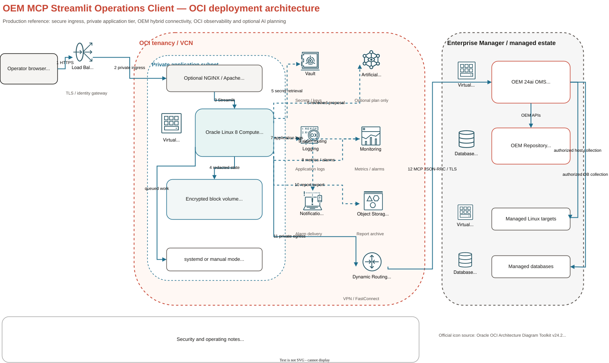

# OEM MCP Streamlit Client

A security-conscious Streamlit GUI for connecting to the Oracle Enterprise Manager 24ai Model Context Protocol (MCP) server, discovering the operations authorized for the signed-in Enterprise Manager account, invoking those operations, and reviewing Linux/OEM metrics and an audit-friendly local history.

The client implements Oracle's HTTP/JSON-RPC transport directly. It does not require an LLM, an external AI service, or an MCP proxy.

## OCI reference architecture and design



The reference deployment uses an OCI private application subnet, Oracle Linux 8 Compute, block-volume-backed local state, and a private path to the OEM managed estate. OCI Load Balancer, Vault, Generative AI, Logging, Monitoring, Notifications, Object Storage, and DRG/VPN/FastConnect are shown as optional integrations. The editable source uses official Oracle OCI Architecture Diagram Toolkit v24.2 stencils.

- [Editable draw.io architecture](docs/architecture/oem-mcp-streamlit-oci-architecture.drawio)
- [SVG architecture render](docs/architecture/oem-mcp-streamlit-oci-architecture.svg)
- [PNG architecture render](docs/architecture/oem-mcp-streamlit-oci-architecture.png)
- [Software Solution Design (DOCX)](docs/architecture/oem-mcp-streamlit-software-solution-design.docx)
- [Software Solution Design (PDF)](docs/architecture/oem-mcp-streamlit-software-solution-design.pdf)
- [Architecture artifact notes](docs/architecture/README.md)

## What the GUI provides

- **Connection** — OEM endpoint, username, password, protocol version, request timeout, TLS verification, custom CA bundle, and reusable non-secret profiles.
- **Capabilities** — initializes MCP and retrieves all advertised tools, prompts, resources, and resource templates, including pagination and input schemas. This tab is discovery-only; NLP requests belong in **Assistant**.
- **Request** — builds an input form from the selected tool's JSON Schema, requires confirmation, validates the input, invokes `tools/call`, and renders structured results.
- **Metrics** — shows the Streamlit Linux server's CPU/load, memory, disk, network, and process metrics. It also ranks authorized OEM tools for Linux targets, databases, and host-to-database relationships.
- **Operations** — refreshes local Linux health, identifies likely OEM metric tools, charts live records, and saves redacted dashboard snapshots.
- **Workspace** — persists named dashboards, runbooks, and read-only SQL queries in a local SQLite workspace.
- **Topology** — invokes a discovered association operation and infers a Graphviz node/edge view while keeping the source result available for verification.
- **SQL** — exposes only a discovered `ExecuteSql` operation, validates a single `SELECT`/`WITH`, and automatically applies a configurable row cap.
- **Incidents** — creates local triage cases with severity, status, filtered evidence, and an append-only timestamped timeline.
- **Assistant** — translates NLP into one reviewed discovered-tool call or a read-only `ExecuteSql` proposal, executes only after confirmation, and can ask OCI Generative AI to explain the OEM result in natural language.
- **Governance** — evaluates deny-first role/tool/target policy rules and supports expiring two-person approvals bound to the exact request hash.
- **Automation** — runs bounded background jobs, queues due read-only schedules during an active authenticated session, creates downloadable reports, and records local alerts.
- **Usage & cost** — records MCP/AI latency, status, token counts, configured cost estimates, and CSV exports.
- **History & logs** — timestamped connection and execution history in SQLite, JSON downloads, and a rotating application log.
- **Diagnostics** — negotiated protocol/server details, safe configuration state, MCP ping, and redacted diagnostic export.

OEM returns operations according to the account's privileges. The GUI discovers that surface at connection time instead of assuming fixed tool names. Oracle currently documents tools as the primary server feature; prompts, resources, and resource templates may be empty, but the client requests and displays all four capability types.

## Implemented priorities

| Priority | Capability | GUI |
| ---: | --- | --- |
| 2 | Live operations dashboard | Operations |
| 3 | Saved dashboards and runbooks | Workspace |
| 4 | OEM topology explorer | Topology |
| 5 | Read-only SQL workbench | SQL |
| 6 | Incident investigation workspace | Incidents |
| 7 | Natural-language assistant | Assistant |
| 8 | Tool-policy engine | Governance |
| 9 | Two-person approval workflow | Governance |
| 10 | Multi-OEM fleet connections | Workspace → Multi-OEM fleet |
| 11 | Background job manager | Automation → Jobs |
| 12 | Schedules, reports, and local alerts | Automation |
| 13 | Usage and estimated-cost accounting | Usage & cost |

Priority 1 (identity-provider/OIDC integration) was not requested and is not implemented. Operator and approver identifiers are therefore procedural strings. Shared or controlled-change deployments require an authenticated TLS reverse proxy now and a future trusted-identity binding before those identifiers can be treated as cryptographic identities.

## Supported OEM MCP behavior

This project targets Enterprise Manager 24ai Release 24.1.0.12 or newer:

- Endpoint: `https://OEM_HOST:OEM_HTTPS_PORT/em/api/mcp`
- Transport: JSON-RPC 2.0 in HTTP `POST` requests using `application/json`
- Authentication: Enterprise Manager username/password through HTTP Basic Authentication
- MCP protocol versions: `2025-11-25` and `2025-06-18`
- Lifecycle: `initialize`, `notifications/initialized`, discovery calls, then tool invocation

Oracle documents that the OEM authorization, validation, audit, and business-rule layers still apply. This client cannot grant additional OEM access.

## Security defaults

- The server listens on `127.0.0.1` by default. Use an authenticated TLS reverse proxy for shared access.
- The OEM password remains in Streamlit session memory. It is never saved to profiles, SQLite history, or application logs.
- TLS verification is enabled. A private CA bundle can be configured without disabling verification.
- Non-secret endpoint profiles are written with restrictive permissions.
- Tools must be advertised as/read like read-only operations by default.
- `ExecuteSql` accepts one `SELECT` or `WITH` statement by default; DDL, DML, and PL/SQL require a deliberate server-side configuration change.
- Binary MCP content is not rendered or downloaded automatically.
- The history database fingerprints usernames and sanitizes endpoints.

Streamlit is an application framework, not an identity gateway. Do not expose this listener directly to an untrusted network. Put NGINX, Apache, an OCI Load Balancer, or another gateway with TLS and user authentication in front of it.

## Prerequisites on Oracle Linux 8

- Network reachability from the Linux host to the OEM HTTPS console
- An OEM 24ai account authorized for the operations you want to use
- Git
- Python 3.9 through 3.13; Python 3.11 is recommended
- `curl`, `ss` (from `iproute`), and standard GNU utilities

Example packages:

```bash
sudo dnf install -y git python3.11 python3.11-pip curl iproute procps-ng
```

The project deliberately rejects old Python versions rather than allowing `pip` to select an obsolete Streamlit release.

## Clean clone

The repository is private. Configure a GitHub SSH key or another approved GitHub authentication method first.

```bash
export PROJECT_DIR=/u03/home/oracle/oci-go--dev-projects/oem-mcp-streamlit-client
git clone git@github.com:eugsim1/oem-mcp-streamlit-client.git "$PROJECT_DIR"
cd "$PROJECT_DIR"
git status --short
```

Do not copy `/path/to/...` examples literally. The `PROJECT_DIR` variable above is the real destination used by every command that follows.

## Deployment A — manual standalone process

This mode runs under the current Linux user and does not create a service.

### 1. Install

```bash
cd "$PROJECT_DIR"
scripts/install-manual.sh --python-bin python3.11
```

On the first run, the installer automatically creates:

```text
$PROJECT_DIR/.runtime/oem-mcp-streamlit.env
```

It is mode `0600`, ignored by Git, and preserved during later installs. Edit the endpoint and optional defaults:

```bash
vi "$PROJECT_DIR/.runtime/oem-mcp-streamlit.env"
```

Recommended values:

```dotenv
STREAMLIT_ADDRESS=127.0.0.1
STREAMLIT_PORT=8501
OEM_MCP_ENDPOINT=https://oem.example.com:7803/em/api/mcp
OEM_MCP_USERNAME=
OEM_MCP_PASSWORD=
OEM_MCP_PROTOCOL_VERSION=2025-11-25
OEM_MCP_VERIFY_TLS=true
OEM_MCP_CA_BUNDLE=
OEM_MCP_TIMEOUT_SECONDS=60
OEM_MCP_OPERATOR_ID=operator
OEM_MCP_OPERATOR_ROLE=operator
OEM_MCP_POLICY_FILE=./config/policy.example.json
OEM_MCP_JOB_WORKERS=2

# Optional OCI Generative AI NLP planner and OEM-result explainer.
OCI_GENAI_OPENAI_ENDPOINT=https://inference.generativeai.eu-frankfurt-1.oci.oraclecloud.com/20231130/actions/v1
OCI_GENAI_MODEL=openai.gpt-oss-120b
OCI_GENAI_AUTH_MODE=api_key
OCI_GENAI_PROJECT_OCID=
OCI_GENAI_API_KEY=
OCI_GENAI_PROFILE=DEFAULT
OCI_GENAI_TIMEOUT_SECONDS=120
OCI_GENAI_INPUT_USD_PER_MILLION=0
OCI_GENAI_OUTPUT_USD_PER_MILLION=0
```

Leave `OEM_MCP_PASSWORD` blank to enter it in the GUI. If an unattended diagnostic requires a password, set it only in the protected runtime file and review the host's access controls.

The adapter supports a regional OCI Generative AI API key for initial testing and OCI session, instance-principal, or resource-principal IAM authentication. It never writes the key to profiles, history, workspace data, or logs. Leave the key blank when using an IAM mode. The **Assistant** tab remains optional; all direct MCP functionality works without an LLM.

### 2. Start on the configured port

```bash
cd "$PROJECT_DIR"
scripts/start-standalone.sh \
  --env-file "$PROJECT_DIR/.runtime/oem-mcp-streamlit.env" \
  --port 8501 \
  --address 127.0.0.1 \
  --wait-seconds 60
```

### 3. Start on another configurable port

The command-line port overrides `STREAMLIT_PORT`:

```bash
scripts/start-standalone.sh \
  --env-file "$PROJECT_DIR/.runtime/oem-mcp-streamlit.env" \
  --port 8502 \
  --address 127.0.0.1
```

Use a different PID file for each port. To bind beyond loopback, add `--allow-non-loopback` only after configuring an authenticated TLS reverse proxy and firewall.

### 4. Check, test, and stop

```bash
scripts/status-standalone.sh --port 8502
scripts/smoke-test.sh --address 127.0.0.1 --port 8502
scripts/stop-standalone.sh --port 8502
```

The standalone log is `logs/streamlit-standalone-PORT.log`; application events are in `logs/oem-mcp-streamlit.log`.

## Deployment B — systemd service

This mode installs dependencies into `/opt`, creates protected runtime directories, and configures restart-on-failure.

### 1. Install the unit and Python environment

```bash
cd "$PROJECT_DIR"
sudo scripts/install-systemd.sh \
  --service-user oracle \
  --service-group oinstall \
  --python-bin /usr/bin/python3.11 \
  --address 127.0.0.1 \
  --port 8502
```

On the first run, the installer automatically creates:

```text
/etc/oem-mcp-streamlit/oem-mcp-streamlit.env
```

The file is owned by `root:oinstall`, mode `0640`, and is preserved on reinstall. It also sets absolute runtime locations:

- data/history: `/var/lib/oem-mcp-streamlit`
- logs: `/var/log/oem-mcp-streamlit`
- virtual environment: `/opt/oem-mcp-streamlit/venv`

### 2. Configure OEM

```bash
sudo vi /etc/oem-mcp-streamlit/oem-mcp-streamlit.env
sudo grep -E '^(STREAMLIT_ADDRESS|STREAMLIT_PORT|OEM_MCP_ENDPOINT|OEM_MCP_PROTOCOL_VERSION|OEM_MCP_VERIFY_TLS)=' \
  /etc/oem-mcp-streamlit/oem-mcp-streamlit.env
```

Do not print the password. Prefer leaving `OEM_MCP_PASSWORD=` empty and entering it in the GUI.

### 3. Start and verify

```bash
sudo scripts/start-service.sh
sudo scripts/status-service.sh
scripts/smoke-test.sh --address 127.0.0.1 --port 8502
sudo journalctl -u oem-mcp-streamlit.service -n 100 --no-pager
```

### 4. Stop or restart

```bash
sudo scripts/stop-service.sh
sudo scripts/restart-service.sh
```

### 5. Change the service port

The port is rendered into the unit, so rerun the installer and restart:

```bash
sudo scripts/install-systemd.sh \
  --service-user oracle \
  --service-group oinstall \
  --python-bin /usr/bin/python3.11 \
  --address 127.0.0.1 \
  --port 8510
sudo scripts/restart-service.sh
scripts/smoke-test.sh --address 127.0.0.1 --port 8510
```

## Clean update/redeployment

### Manual mode

```bash
cd "$PROJECT_DIR"
scripts/stop-standalone.sh --port 8502
git status --short
git pull --ff-only
scripts/install-manual.sh --python-bin python3.11
scripts/start-standalone.sh \
  --env-file "$PROJECT_DIR/.runtime/oem-mcp-streamlit.env" \
  --address 127.0.0.1 \
  --port 8502
scripts/smoke-test.sh --address 127.0.0.1 --port 8502
```

### systemd mode

```bash
cd "$PROJECT_DIR"
git status --short
git pull --ff-only
sudo scripts/install-systemd.sh \
  --service-user oracle \
  --service-group oinstall \
  --python-bin /usr/bin/python3.11 \
  --address 127.0.0.1 \
  --port 8502
sudo scripts/restart-service.sh
scripts/smoke-test.sh --address 127.0.0.1 --port 8502
```

The installers preserve the environment files. Review local changes before `git pull`; do not discard work you intend to keep.

## Connection workflow in the GUI

1. Open **Connection**.
2. Enter `https://OEM_HOST:OEM_PORT/em/api/mcp`, the OEM username, and password.
3. Keep TLS verification enabled; select a custom CA bundle if OEM uses an internal CA.
4. Select protocol `2025-11-25` (or `2025-06-18` for a server that requires it).
5. Click **Connect, initialize, and discover**.
6. Review every authorized operation and schema in **Capabilities**.
7. Run an operation from **Request**, or use the focused **Operations**, **Topology**, or **SQL** workflow.
8. Save reusable results and procedures under **Workspace**, and create investigation timelines under **Incidents**.
9. Review policy decisions and exact-request approvals in **Governance** before any controlled execution.
10. Queue bounded work or read-only schedules in **Automation**, then reconcile results in **Usage & cost** and **History & logs**.

## Natural-language requests: Capabilities versus Assistant

The OEM MCP server does not expose the Oracle AI Database Assistant chat box as an MCP tool. The two products share Enterprise Manager data and authorization, but they are different interfaces:

- **Capabilities** discovers the tools authorized for the connected OEM user and shows each tool's exact JSON input schema. It does not accept NLP.
- **Request** manually invokes a selected discovered tool after you complete its schema-generated form.
- **Assistant** accepts NLP, asks the selected planner to propose one discovered tool plus arguments, requires review, invokes that tool through the normal safety path, and optionally asks OCI Generative AI to explain the returned OEM result.
- **SQL** is a manual read-only workbench for a discovered `ExecuteSql` tool.

The Streamlit NLP flow is deliberately reviewable:

```text
NLP request
    → OCI model selects one actually discovered OEM tool and arguments
    → operator reviews/corrects arguments or generated SQL
    → policy + approval + read-only SQL validation
    → OEM MCP tools/call
    → raw OEM result
    → optional OCI model summary grounded only in that result
```

### Run an NLP request

1. In **Connection**, connect and wait for discovery to complete.
2. In **Capabilities**, confirm that the account exposes a relevant incident, target, job, metric, status, or `ExecuteSql` tool. Expand the tool and inspect required properties.
3. Open **Assistant**.
4. Select **OCI Generative AI**. The local deterministic option only ranks tool names; it cannot reliably generate missing NLP arguments or SQL.
5. Select an execution strategy:
   - **Auto — prefer OEM operations**: recommended. It prefers a purpose-built OEM tool and uses `ExecuteSql` only when explicitly requested.
   - **OEM operations only — exclude ExecuteSql**: prevents the planner from proposing SQL.
   - **ExecuteSql only — read-only SQL**: sends only the discovered `ExecuteSql` schema to the planner.
6. Enter the request and select **Build reviewed proposal**.
7. Check the selected tool, explanation, confidence, and editable JSON arguments. When `ExecuteSql` is selected, the generated SQL is displayed separately.
8. Correct any target name, time range, pagination limit, or SQL object. Select the review confirmation and then **Execute reviewed proposal**.
9. Inspect the raw OEM result. To receive a concise answer, select **Generate a natural-language answer from this OEM result**. This second model call receives the original question and a redacted, bounded copy of the OEM result.
10. Review latency, token counts, and configured cost estimates in **Usage & cost**. OEM server-side audit remains authoritative for the executed operation.

### Example requests

| NLP request | Recommended strategy | Expected planning behavior |
| --- | --- | --- |
| `List all open incidents` | Auto | Select an advertised incident-list/search tool and populate its open-status filter. |
| `List targets that are down` | Auto | Select an advertised target/status tool and populate the availability filter. |
| `Show job executions in the last 24 hours` | Auto | Select an advertised job-execution tool and populate its relative or absolute time range according to the live schema. |
| `Summarize status for all my targets` | Auto | Select a target-status/list tool; after execution, use answer synthesis to summarize only the rows OEM returned. |
| `Using ExecuteSql, count targets by target type from MGMT$TARGET` | ExecuteSql only | Generate one read-only query, show it for review, apply the SQL safety gate, then execute it through OEM. |

Tool names and required argument names vary by OEM release and user privileges. The planner receives only the tools returned by the live **Capabilities** discovery and rejects a model-proposed tool name that was not discovered.

### Important SQL limitation

An MCP `ExecuteSql` input schema identifies the SQL argument but is not a catalog of OEM repository views and columns. The model must not invent repository objects. Prefer purpose-built OEM tools for incidents, targets, jobs, and metrics. If SQL is necessary, include the approved view/column context in the request, review the generated statement, and verify it against the OEM repository version.

The client accepts one `SELECT` or `WITH` statement by default. It rejects DDL, DML, PL/SQL, and multiple statements even if the model proposes them. OEM privileges and the Free Query API apply an additional server-side authorization boundary.

## OCI Generative AI setup — Frankfurt

The LLM is optional for direct MCP use but required for reliable free-form NLP planning and natural-language answer synthesis in this client. These examples use Germany Central (Frankfurt), region identifier `eu-frankfurt-1`. `openai.gpt-oss-120b` and `openai.gpt-oss-20b` are documented for Frankfurt; confirm current model access, limits, and pricing in the tenancy before production use.

### Choose the endpoint and authentication route

OCI exposes two relevant OpenAI-compatible base paths. Do not mix their requirements:

| Use case | Base endpoint | `OCI_GENAI_AUTH_MODE` | Project OCID | API-key secret | SDK profile |
| --- | --- | --- | --- | --- | --- |
| Simplest regional Generative AI API-key test | `https://inference.generativeai.eu-frankfurt-1.oci.oraclecloud.com/20231130/actions/v1` | `api_key` | Leave blank; not sent | Required | Ignored |
| API key through a Generative AI project | `https://inference.generativeai.eu-frankfurt-1.oci.oraclecloud.com/openai/v1` | `api_key` | Required | Required | Ignored |
| OCI CLI session | `https://inference.generativeai.eu-frankfurt-1.oci.oraclecloud.com/openai/v1` | `session` | Required | Leave blank | Required |
| OCI Compute instance principal | `https://inference.generativeai.eu-frankfurt-1.oci.oraclecloud.com/openai/v1` | `instance_principal` | Required | Leave blank | Ignored |
| OCI resource principal | `https://inference.generativeai.eu-frankfurt-1.oci.oraclecloud.com/openai/v1` | `resource_principal` | Required | Leave blank | Ignored |

API-key authentication is independent of Compute instance-principal configuration. A Compute instance does **not** need to be in a dynamic group when `OCI_GENAI_AUTH_MODE=api_key`; the Generative AI API-key principal and its IAM policy authorize that request.

### 1A. Simplest API-key setup and IAM policy

1. Sign in to the OCI Console and select **Germany Central (Frankfurt)**.
2. Open **Analytics & AI → Generative AI → API keys**, choose the compartment, and create a regional key.
3. Copy the API-key OCID beginning with `ocid1.generativeaiapikey...`; it identifies the principal in IAM but is not a secret.
4. Copy one generated secret immediately. This one-time secret is the value for `OCI_GENAI_API_KEY`. Store it in an approved secret store and rotate it according to organizational policy.
5. Create a least-privilege IAM policy. A policy restricted to one key and one compartment is:

```text
Allow any-user to use generative-ai-family in compartment <GENAI_COMPARTMENT_NAME>
where ALL {request.principal.type='generativeaiapikey',
           request.principal.id='<GENERATIVE_AI_API_KEY_OCID>'}
```

For a short tenancy-wide administrator diagnostic, the broad form is:

```text
Allow any-user to use generative-ai-family in tenancy
where ALL {request.principal.type='generativeaiapikey'}
```

Reduce the broad policy to the single-key, compartment-scoped form after the test. `Allow group Administrators ... where request.principal.type='generativeaiapikey'` is not the equivalent policy: an API-key request is an `any-user` Generative AI API-key principal, not an Administrators-group user principal. Preserve both closing quotes and braces when entering the policy.

Configure the protected runtime file:

```dotenv
OCI_GENAI_OPENAI_ENDPOINT=https://inference.generativeai.eu-frankfurt-1.oci.oraclecloud.com/20231130/actions/v1
OCI_GENAI_MODEL=openai.gpt-oss-120b
OCI_GENAI_AUTH_MODE=api_key
OCI_GENAI_PROJECT_OCID=
OCI_GENAI_API_KEY=REPLACE_WITH_GENERATED_SECRET_NOT_THE_KEY_OCID
OCI_GENAI_PROFILE=DEFAULT
OCI_GENAI_TIMEOUT_SECONDS=120
OCI_GENAI_INPUT_USD_PER_MILLION=0
OCI_GENAI_OUTPUT_USD_PER_MILLION=0
```

Use only the plain endpoint. This value is invalid because it contains Markdown:

```text
[https://inference.generativeai.eu-frankfurt-1.oci.oraclecloud.com/...](https://inference.generativeai.eu-frankfurt-1.oci.oraclecloud.com/...)
```

`echo $$OCI_GENAI_API_KEY` is also not a variable check: `$$` expands to the shell process ID and the remaining text is literal. Never print the secret. A safe presence check is:

```bash
printf 'Secret configured: %s; length=%s\n' \
  "$([[ -n ${OCI_GENAI_API_KEY:-} ]] && printf yes || printf no)" \
  "${#OCI_GENAI_API_KEY}"
```

Edit and protect the file as appropriate:

```bash
# Manual deployment
vi "$PROJECT_DIR/.runtime/oem-mcp-streamlit.env"
chmod 600 "$PROJECT_DIR/.runtime/oem-mcp-streamlit.env"

# systemd deployment
sudo vi /etc/oem-mcp-streamlit/oem-mcp-streamlit.env
sudo chown root:oinstall /etc/oem-mcp-streamlit/oem-mcp-streamlit.env
sudo chmod 640 /etc/oem-mcp-streamlit/oem-mcp-streamlit.env
```

The two cost variables are operator-maintained estimates. Set them from the current OCI price list or leave them at zero; OCI Billing and Cost Analysis remain authoritative.

### 1B. Optional project endpoint

Use this route when the OCI project workflow or an IAM authentication mode is required:

1. In Frankfurt, open **Analytics & AI → Generative AI → Projects**.
2. Create a project such as `oem-mcp-nlp` in the intended compartment and configure retention according to the organization's data-handling policy.
3. Open **How to use** or project details and copy the project OCID beginning with `ocid1.generativeaiproject...`.
4. Change the endpoint to `/openai/v1` and set the project OCID:

```dotenv
OCI_GENAI_OPENAI_ENDPOINT=https://inference.generativeai.eu-frankfurt-1.oci.oraclecloud.com/openai/v1
OCI_GENAI_AUTH_MODE=api_key
OCI_GENAI_PROJECT_OCID=ocid1.generativeaiproject.oc1.eu-frankfurt-1.aaaa_REPLACE_ME
OCI_GENAI_API_KEY=REPLACE_WITH_GENERATED_SECRET_NOT_THE_KEY_OCID
```

The three identifiers remain distinct:

| Field | Expected value |
| --- | --- |
| `OCI_GENAI_PROJECT_OCID` | Project identifier beginning `ocid1.generativeaiproject...` |
| `request.principal.id` in IAM | API-key identifier beginning `ocid1.generativeaiapikey...` |
| `OCI_GENAI_API_KEY` | Generated secret; never an OCID |

### 2. Production on OCI Compute with instance principal

Instance principal avoids storing a long-lived Generative AI API-key secret. It is an alternative to `api_key`, not a prerequisite for it.

1. Create a dynamic group with a narrow rule such as:

```text
ALL {instance.id = '<STREAMLIT_COMPUTE_INSTANCE_OCID>'}
```

2. Grant the dynamic group access to chat inference and the project in the selected compartment:

```text
Allow dynamic-group oem-mcp-streamlit-instances to use generative-ai-chat
in compartment <GENAI_COMPARTMENT_NAME>

Allow dynamic-group oem-mcp-streamlit-instances to use generative-ai-project
in compartment <GENAI_COMPARTMENT_NAME>
```

3. Configure the project endpoint and leave the secret blank:

```dotenv
OCI_GENAI_OPENAI_ENDPOINT=https://inference.generativeai.eu-frankfurt-1.oci.oraclecloud.com/openai/v1
OCI_GENAI_MODEL=openai.gpt-oss-120b
OCI_GENAI_AUTH_MODE=instance_principal
OCI_GENAI_PROJECT_OCID=ocid1.generativeaiproject.oc1.eu-frankfurt-1.aaaa_REPLACE_ME
OCI_GENAI_API_KEY=
OCI_GENAI_PROFILE=DEFAULT
OCI_GENAI_TIMEOUT_SECONDS=120
```

The `oci-genai-auth` dependency supplies `OciInstancePrincipalAuth`; no OCI SDK profile or API signing key is needed. The instance still needs TCP 443 egress to the Frankfurt inference endpoint and access to the OCI instance metadata service. Test as the same Linux service user because network, environment, and file permissions can differ by user.

### 3. Development with an OCI CLI session profile

An OCI SDK profile is a named section in `~/.oci/config`. `DEFAULT` means `[DEFAULT]`; profile names are operator-defined, so `[FRANKFURT]`, `[PROD]`, and `[OEM_GENAI]` are also possible. This application reads the profile only in `session` mode.

```bash
oci session authenticate \
  --region eu-frankfurt-1 \
  --profile-name OEM_GENAI
```

```dotenv
OCI_GENAI_OPENAI_ENDPOINT=https://inference.generativeai.eu-frankfurt-1.oci.oraclecloud.com/openai/v1
OCI_GENAI_AUTH_MODE=session
OCI_GENAI_PROFILE=OEM_GENAI
OCI_GENAI_PROJECT_OCID=ocid1.generativeaiproject.oc1.eu-frankfurt-1.aaaa_REPLACE_ME
OCI_GENAI_API_KEY=
```

The Streamlit process must run as the Linux user that can read that profile and its session files. Sessions expire and are not suitable for an unattended systemd service. `resource_principal` is intended for services such as Functions or OKE; use `instance_principal` for an ordinary OCI Compute instance.

### 4. Standalone API-key diagnostic — no Streamlit

The standard-library test program sends one fixed harmless prompt to the OCI Responses API. It does not import Streamlit or the OpenAI SDK, execute an environment file as shell code, print the API-key secret, write credentials, follow redirects, or contact OEM.

From the project directory, test the manual runtime file:

```bash
python3.11 scripts/oci_genai_diagnostic.py \
  --env-file "$PROJECT_DIR/.runtime/oem-mcp-streamlit.env"
```

If `OCI_GENAI_API_KEY` is blank, the program prompts securely. For non-interactive testing, populate the protected file and add `--no-prompt`. Validate the values without sending a request:

```bash
python3.11 scripts/oci_genai_diagnostic.py \
  --env-file "$PROJECT_DIR/.runtime/oem-mcp-streamlit.env" \
  --check-config
```

Test the systemd configuration as the service user:

```bash
sudo -u oracle "$PROJECT_DIR/.venv/bin/python" \
  "$PROJECT_DIR/scripts/oci_genai_diagnostic.py" \
  --env-file /etc/oem-mcp-streamlit/oem-mcp-streamlit.env \
  --no-prompt
```

If the normal request returns an HTML `400`, bypass proxy variables for one controlled test:

```bash
python3.11 scripts/oci_genai_diagnostic.py \
  --env-file "$PROJECT_DIR/.runtime/oem-mcp-streamlit.env" \
  --no-proxy
```

The program prints configured proxy variable names but never their values. If `--no-proxy` succeeds, work with the network team to correct `HTTPS_PROXY` and `NO_PROXY`; do not permanently bypass an organization-required proxy.

### 5. Manual debug checklist

1. Confirm the non-secret values are plain strings. `declare -p` preserves hidden characters and makes accidental Markdown visible:

   ```bash
   declare -p OCI_GENAI_OPENAI_ENDPOINT OCI_GENAI_MODEL OCI_GENAI_AUTH_MODE
   declare -p OCI_GENAI_PROJECT_OCID
   ```

2. Confirm DNS and TLS without sending credentials:

   ```bash
   getent ahosts inference.generativeai.eu-frankfurt-1.oci.oraclecloud.com
   openssl s_client \
     -connect inference.generativeai.eu-frankfurt-1.oci.oraclecloud.com:443 \
     -servername inference.generativeai.eu-frankfurt-1.oci.oraclecloud.com \
     </dev/null
   ```

3. List only the names of configured proxy variables, never their possibly credential-bearing values:

   ```bash
   for name in HTTPS_PROXY https_proxy HTTP_PROXY http_proxy ALL_PROXY all_proxy NO_PROXY no_proxy; do
     [[ -n ${!name:-} ]] && printf '%s=<set>\n' "$name"
   done
   ```

4. In the Frankfurt OCI Console, open the Generative AI playground/project model selector. Confirm `openai.gpt-oss-120b` is selectable for the same region and compartment. Also check **Governance & Administration → Limits, Quotas and Usage** for Generative AI capacity. A model listed in documentation can still be unavailable to a particular tenancy, endpoint type, or capacity configuration.
5. Recheck the key's region, active/expiration state, the exact API-key OCID used in IAM, policy placement and compartment, and allow time for a recent IAM policy change to propagate.
6. Do not use `curl -v`, shell tracing (`set -x`), command-line `--header "Authorization: Bearer ..."` in shared process listings, or diagnostic archives containing the secret.

Response interpretation:

| Result | Meaning and next check |
| --- | --- |
| `2xx` JSON | Authentication, endpoint, model, and request shape worked. Continue with Streamlit. |
| `400` HTML | A proxy/gateway or malformed/re-written URL answered before the OCI JSON API. This is not caused by the Compute instance lacking instance-principal setup. Check Markdown in the endpoint, proxy variables, DNS/TLS interception, and `--no-proxy`. |
| `400` JSON | Read the OCI message; check the base path, model, body shape, and project header requirement. |
| `401` JSON | The bearer value is missing, expired, or is the API-key OCID instead of the generated secret. |
| `403`/`404` JSON | Check IAM scope, API-key OCID, key region, project access for `/openai/v1`, model visibility, and endpoint availability. OCI can intentionally combine authorization and not-found responses. |
| Timeout/DNS/TLS error | Check route/NAT/service gateway/proxy/firewall/CA and run from the same user and host as Streamlit. |

An HTML page has no OCI `opc-request-id` and is not useful evidence for changing IAM. A JSON OCI error plus `opc-request-id` is the point at which IAM, project, key, and model authorization should be reviewed.

### 6. Restart Streamlit and validate the NLP workflow

Manual standalone deployment:

```bash
scripts/stop-standalone.sh --port 8502
scripts/start-standalone.sh \
  --env-file "$PROJECT_DIR/.runtime/oem-mcp-streamlit.env" \
  --address 127.0.0.1 \
  --port 8502 \
  --wait-seconds 60
scripts/smoke-test.sh --address 127.0.0.1 --port 8502
```

systemd deployment:

```bash
sudo scripts/restart-service.sh
sudo scripts/status-service.sh
sudo journalctl -u oem-mcp-streamlit.service -n 100 --no-pager
scripts/smoke-test.sh --address 127.0.0.1 --port 8502
```

Then connect to OEM and test in **Assistant**:

```text
Planner: OCI Generative AI
Strategy: Auto — prefer OEM operations
Request: List all open incidents
```

Build and review the proposal. After successful execution, generate the answer from the returned OEM result. Confirm separate `assistant` events for `plan` and `answer` under **Usage & cost**.

Application-level troubleshooting after the standalone OCI test passes:

- `OCI_GENAI_PROJECT_OCID is required`: `/openai/v1` requires a project OCID; either provide it or use the `/20231130/actions/v1` API-key route.
- Planner returns empty arguments: inspect the selected tool's required schema in **Capabilities** and add the missing target, time range, pagination, or approved SQL catalog context.
- Generated SQL is rejected: the client permits only one read-only `SELECT`/`WITH`; correct the statement rather than weakening `OEM_MCP_ALLOW_NONSELECT_SQL`.
- Answer synthesis omits rows: check OEM pagination and whether the result was bounded before transmission. The raw OEM result remains visible for verification.

## Advanced workflow controls

- Every focused execution uses the same JSON Schema validation, deny-first policy, approval lookup, mutation gate, SQL filter, OEM authorization, redacted history, and usage-recording path.
- A matching deny policy always wins. If no custom rule matches, the safe fallback permits recognized read-only tools and validated `ExecuteSql`; other operations are denied.
- Approval records bind a sanitized endpoint, exact tool name, and canonical arguments; secret-valued fields contribute one-way SHA-256 fingerprints while their persisted values remain redacted. The requester cannot approve the same request, and approvals expire.
- Multi-OEM passwords and connected clients live only in the running Streamlit session and must be recreated after restart.
- Jobs use a bounded in-process worker pool. Persisted `queued` or `running` records are evidence requiring reconciliation after a crash, not proof that execution resumed.
- Schedules run only while the application and an authenticated OEM session are active. Direct external delivery is intentionally left to OCI Notifications or an approved enterprise channel.
- Cost figures are estimates calculated from operator-configured token rates; OCI billing and Cost Analysis remain authoritative.

## Diagnostics and tests

Local, redacted diagnostics:

```bash
scripts/diagnose.sh --env-file "$PROJECT_DIR/.runtime/oem-mcp-streamlit.env"
```

End-to-end OEM initialize/discovery test (requires `OEM_MCP_USERNAME` and `OEM_MCP_PASSWORD` in the protected environment file):

```bash
scripts/diagnose.sh \
  --connect \
  --env-file "$PROJECT_DIR/.runtime/oem-mcp-streamlit.env"
```

Developer test suite:

```bash
scripts/install-manual.sh --python-bin python3.11 --with-dev
scripts/test.sh
```

The test suite uses a fake MCP transport and does not need an OEM server. The `--connect` diagnostic is the explicit real-server test.

## Troubleshooting

### `ERROR: environment file is not readable`

Run the matching installer first. Manual installation creates `$PROJECT_DIR/.runtime/oem-mcp-streamlit.env`; systemd installation creates `/etc/oem-mcp-streamlit/oem-mcp-streamlit.env`. For the systemd file, use `sudo` to inspect permissions.

### Streamlit cannot install or only very old releases are listed

The Python interpreter is too old or the configured package index is stale. Verify:

```bash
python3.11 --version
python3.11 -m pip config list
python3.11 -m pip index versions streamlit
```

Then rerun the installer with `--python-bin /usr/bin/python3.11`. Do not work around the version check by installing an obsolete Streamlit release.

### OEM connection fails

```bash
curl --fail --silent --show-error \
  --cacert /path/to/company-ca.pem \
  -o /dev/null \
  https://oem.example.com:7803/em/api/mcp
```

An HTTP authentication response still proves TLS/network reachability. Verify the OEM version, endpoint path, account privileges, proxy rules, and CA chain. Never use `curl -k` with production credentials.

### No tools, metrics, or relationships appear

The GUI only displays the surface that OEM returns for the authenticated user. Check **Capabilities** and **Diagnostics**, then have an OEM administrator review the account's target and operation privileges. Tool names may vary by OEM version, so the metrics views rank the live discovery results instead of hard-coding undocumented names.

### Service fails to start

```bash
sudo systemctl status oem-mcp-streamlit.service --no-pager -l
sudo journalctl -u oem-mcp-streamlit.service -n 200 --no-pager
sudo systemd-analyze verify /etc/systemd/system/oem-mcp-streamlit.service
sudo -u oracle /opt/oem-mcp-streamlit/venv/bin/python -m compileall -q "$PROJECT_DIR/app.py" "$PROJECT_DIR/oem_mcp_client"
```

## Deliberate limitations

- No OAuth or SSE transport is implemented because Oracle's documented OEM MCP server uses Basic Authentication and stateless HTTP `POST` messages.
- The assistant proposes exactly one discovered operation and never auto-executes it. It is not the built-in Oracle AI Database Assistant and does not implement autonomous multi-tool loops.
- OCI Generative AI planning sends the NLP prompt and compact discovered-tool schemas to OCI. Answer synthesis separately sends the prompt and a redacted, bounded OEM result only after the operator selects the synthesis button.
- Priority 1 identity-provider integration is excluded. Two-person approval is procedural until the deployment binds operator identity through a trusted authenticated gateway.
- Background work is process-local, schedules require an active authenticated application session, and external alert delivery is a platform integration rather than an in-app sender.
- Topology is best-effort inference over live returned fields and must be checked against OEM before operational decisions.
- Local history supports operator troubleshooting; it is not a replacement for OEM's authoritative server-side audit records.
- Disabling TLS verification, enabling mutating tools, or enabling non-SELECT SQL weakens the safety boundary and requires an explicit operational security review.

## Sources

- [Oracle blog: Oracle Enterprise Manager MCP Server—Bringing Enterprise Manager Data to AI Agents](https://blogs.oracle.com/observability/oracle-enterprise-manager-mcp-server-bringing-enterprise-manager-data-to-ai-agents)
- [Oracle Enterprise Manager 24ai MCP Server documentation](https://docs.oracle.com/en/enterprise-manager/cloud-control/enterprise-manager-cloud-control/24.1/emadm/enterprise-manager-model-context-protocol-server.html)
- [Oracle AI Database Assistant](https://docs.oracle.com/en/enterprise-manager/cloud-control/enterprise-manager-cloud-control/24.1/emadm/oracle-ai-database-assistant.html)
- [Oracle OCI Architecture Diagram Toolkit and graphics guidance](https://docs.oracle.com/en-us/iaas/Content/General/Reference/graphicsfordiagrams.htm)
- [Oracle OCI Generative AI OpenAI-compatible API](https://docs.oracle.com/en-us/iaas/Content/generative-ai/openai-compatible-api.htm)
- [OCI Generative AI projects](https://docs.oracle.com/en-us/iaas/Content/generative-ai/projects.htm)
- [Create an OCI Generative AI project](https://docs.oracle.com/en-us/iaas/Content/generative-ai/create-project.htm)
- [Use an OCI Generative AI project](https://docs.oracle.com/en-us/iaas/Content/generative-ai/use-project.htm)
- [OCI Generative AI API keys and supported API-key regions](https://docs.oracle.com/en-us/iaas/Content/generative-ai/api-keys.htm)
- [Create an OCI Generative AI API key](https://docs.oracle.com/en-us/iaas/Content/generative-ai/create-api-key.htm)
- [Add IAM permissions for a Generative AI API key](https://docs.oracle.com/en-us/iaas/Content/generative-ai/add-api-permission.htm)
- [OCI Generative AI IAM authentication helpers](https://docs.oracle.com/en-us/iaas/Content/generative-ai/oci-genai-auth.htm)
- [OCI Generative AI models by region](https://docs.oracle.com/en-us/iaas/Content/generative-ai/model-endpoint-regions.htm)
- [OCI SDK configuration profiles](https://docs.oracle.com/en-us/iaas/tools/python/latest/configuration.html)
- [MCP lifecycle specification (2025-11-25)](https://modelcontextprotocol.io/specification/2025-11-25/basic/lifecycle)
- [MCP tools specification (2025-06-18)](https://modelcontextprotocol.io/specification/2025-06-18/server/tools)
- [MCP transport specification (2025-06-18)](https://modelcontextprotocol.io/specification/2025-06-18/basic/transports)

## License and support

MIT licensed. This is an independent client, not an Oracle product. See [DISCLAIMER.md](DISCLAIMER.md) and [SECURITY.md](SECURITY.md).
